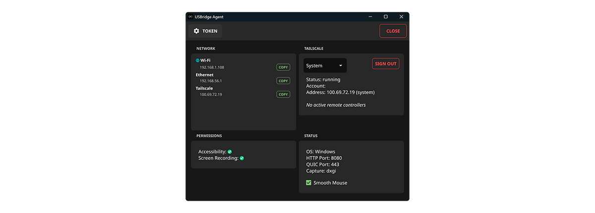

<div align="center">

# USBridge Agent

**Turn any PC into a USBridge — no hardware required.**




</div>

One binary. Windows, macOS, Linux — same codebase, same protocol as the
physical [USBridge](https://github.com/itsme228/usbridge_client) KVM. Install
it on any machine and [usbridge_client](https://github.com/itsme228/usbridge_client)
controls it exactly like it would a real USBridge device.

## Why

- **No relay, no port forwarding.** Tailscale is built in — system or userspace,
  agent registers itself on the tailnet on boot. Connect direct on LAN or
  over Tailscale, nothing else in between.
- **Sunshine does the heavy lifting.** GameStream-grade hardware capture/encode,
  bundled and auto-launched. The agent never touches a video frame — it pairs
  with Sunshine's admin API, relays Moonlight PINs, gets out of the way.
- **Every request signed.** HMAC-SHA256 over the master key, ±60s replay window.
  Pairing itself is AES-256-GCM. Same scheme as the client and the hardware unit.
- **Native input, not a shim.** `SendInput` on Windows, `CGEvent`/Quartz on
  macOS, direct injection on Linux.
- **No Wayland nag screen.** Flip Sunshine to KMS capture once — a single
  `pkexec` grant sets `CAP_SYS_ADMIN` on the binary, persists across reboots —
  and the portal permission dialog never comes back.
- **A control window that tells you something.** LAN/Tailscale addresses,
  Sunshine health, permission status, Tailscale sign-in — all in one place,
  not buried in a tray icon.

## Quick start

```
1. Run the agent on the machine you want to control.
2. It shows a pairing token + LAN/Tailscale address.
3. Install usbridge_client anywhere else, scan/enter the token, connect.
```

That's the whole setup.

## Build

```bash
# macOS
./scripts/build_macos.sh && ./scripts/install_macos.sh
open "$HOME/Applications/USBridgeAgent.app"

# Windows — MSYS2 UCRT64
./scripts/build_windows.sh

# Linux
./scripts/build_linux.sh

# or just run it
go run ./cmd/usbridge_agent
```

Each script fetches and stages the matching Sunshine release automatically.

```
USBRIDGE_SKIP_SUNSHINE=1        skip bundling Sunshine (dev builds)
USBRIDGE_SUNSHINE_FORCE=1       re-download even if already staged
USBRIDGE_SUNSHINE_VERSION=<tag> pin a specific Sunshine release
```

> **macOS:** grant Screen Recording + Accessibility when prompted, then always
> launch from the same installed path (`~/Applications/USBridgeAgent.app`).
> Dev builds aren't ad-hoc signed, so re-signing on every rebuild looks like a
> new app to macOS and both prompts come back.

## License

GPLv3 — see [`LICENSE`](LICENSE). Bundles [Sunshine](https://github.com/LizardByte/Sunshine) (GPLv3).
